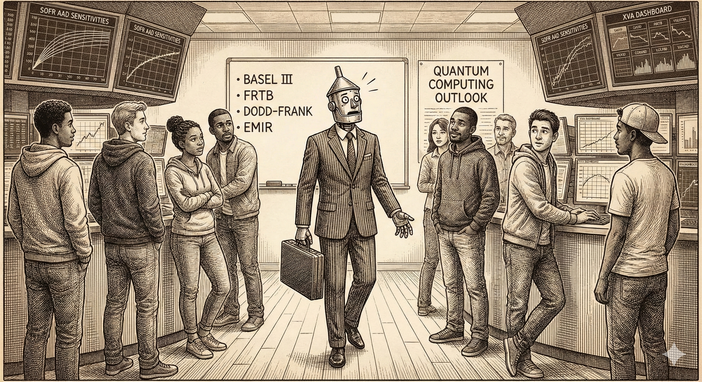
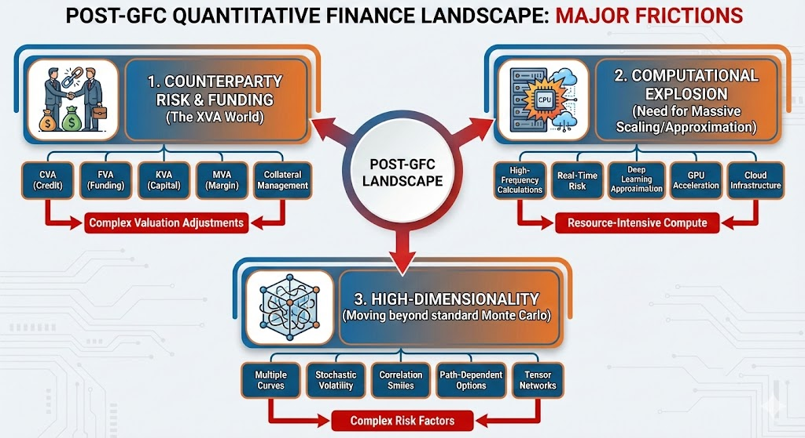

# **The Rusty Quant Modernization Manifesto**

**"Everything you knew in 2007 is now a special case of something more complex."**

---

---

"Modern" refers to the regime shift following the 2008 Global Financial Crisis (GFC). If your toolkit is strictly Black-Scholes and closed-form solutions, you are rusty.

---

This initiative is a specialized node within [**Around the World (of Analytical Modelling) in 81 Repos**](https://www.google.com/search?q=https://github.com/roguetrainer/around-the-world-in-81-repos)—a broader project exploring diverse analytical frontiers including biology, genetics, statistics, audio processing, agentic workflows, and more.

## **The Objective**

This repository serves as a roadmap for the quantitative finance practitioner looking to upgrade their stack from the "Classic Era" to the "Modern Era."

The post-GFC landscape is defined by three major frictions that did not exist (or were ignored) previously:

1. **Counterparty Risk & Funding** (The XVA World)  
2. **Computational Explosion** (The need for massive scaling or approximation)  
3. **High-Dimensionality** (Moving beyond standard Monte Carlo)

---

---

Below is the reference implementation stack for navigating this landscape, maintained by [roguetrainer](https://github.com/roguetrainer).

## **1\. The Foundation: Modern Curve Construction**

Before you can price exotics, you must price the baseline correctly. The single-curve world is dead; we now live in a multi-curve, collateral-dependent reality.

* [**tensor-yield**](https://www.google.com/search?q=https://github.com/roguetrainer/tensor-yield)  
  * *The Core Implementation.* This repository contains the modern approach to yield curve construction and calibration. It replaces legacy curve stripping with tensor-based approaches suitable for automatic differentiation and complex optimization landscapes.  
* [**tensor-scalpel**](https://www.google.com/search?q=https://github.com/roguetrainer/tensor-scalpel)  
  * Precise diagnostics and surgical tooling for tensor operations within financial contexts.

## **2\. The XVA Challenge**

Valuation Adjustments (XVA) are not a post-trade reporting add-on; they are integral to the price.

* [**quantlib-xva-engine**](https://github.com/roguetrainer/quantlib-xva-engine)  
  * A rigorous implementation of XVA frameworks utilizing the industry-standard QuantLib. This represents the "Classic Modern" approach—using established libraries to solve new regulatory problems.

## **3\. The Computational Leap (Deep Learning & Tensors)**

When the dimensionality of the risk factors explodes (as it does in XVA and hybrid models), standard methods fail. We must turn to approximation via Deep Learning and physics-inspired Tensor Networks.

* [**deep-xva**](https://github.com/roguetrainer/deep-xva)  
  * Leveraging neural networks to approximate the pricing functional. This allows for massive acceleration of XVA calculations, trading a small amount of accuracy for orders of magnitude in speed.  
* [**tensor\_networks\_finance**](https://github.com/roguetrainer/tensor_networks_finance)  
  * Applying Tensor Train (TT) decompositions and other tensor network geometries to high-dimensional financial problems. This is the cutting edge of efficient representation for financial states.

## **4\. The Holistic View: Systemic Risk**

Most quants are trained to manage risk at the **institution level** (Micro-prudential). However, modern regulations (CCAR, Basel III/IV) are designed to safeguard the **global financial system** (Macro-prudential).

To stop just "obeying the rules" and start understanding the physics of the market collapse:

* [**Systemic Risk Models in a Nutshell**](https://github.com/roguetrainer/systemic-risk/blob/main/docs/systemic-risk-overview.md)  
  * A primer on network theory, contagion, and why minimizing your bank's VaR might actually increase the system's fragility.
* [**Case Study - GPU Financial Complex**](https://github.com/roguetrainer/systemic-risk/blob/main/docs/gpu-financial-complex.md)
  * Are there lessons to be learned from the 2008 GFC that can be applied to understanding the 2025-26 AI bubble? Is it different this time?

### More systemic risk repos
[systemic-risk](https://github.com/roguetrainer/systemic-risk) | [systemic-risk-intro](https://github.com/roguetrainer/systemic-risk-intro) | [systemic-risk-metrics](https://github.com/roguetrainer/systemic-risk-metrics) | [silicon-subprime](https://github.com/roguetrainer/silicon-subprime) | [too-big-to-teraflop](https://github.com/roguetrainer/too-big-to-teraflop) | [systemic-risk/docs/](https://github.com/roguetrainer/systemic-risk/blob/main/docs/) {
 [systemic-risk-overview](https://github.com/roguetrainer/systemic-risk/blob/main/docs/systemic-risk-overview.md) | [gpu-financial-complex](https://github.com/roguetrainer/systemic-risk/blob/main/docs/gpu-financial-complex)}

---

## **5\. Future Proofing: The Quantum Horizon**

While still speculative, the next regime shift will likely be hardware-driven.

* [**quantum-computing-for-finance**](https://github.com/roguetrainer/quantum-computing-for-finance)  
  * *The Frontier.* A playground for applying Quantum Amplitude Estimation (QAE) and Variational Quantum Eigensolvers (VQE) to financial problems. This is where we test if the hype matches the math.  
* **Key Concepts:**  
  * **Quantum Monte Carlo:** Leveraging QAE to achieve quadratic speedups over classical MC.  
  * **Quantum Machine Learning:** For regime detection and optimization landscapes that are intractable on classical silicon.

*Keep an eye on this space. The Rusty Quant ignores hardware; the Modern Quant optimizes for GPU; the Future Quant prepares for QPU.*

## **🦀 Rust Levels: Self-Assessment Guide**

How rusty is your quant toolkit? Three levels of knowledge decay:

### **1. Surface Rust** (Squeaky when you move)

* You know the classics but haven't kept up with the latest papers
* Familiar with transformers but not attention mechanisms in market microstructure
* Understands Black-Scholes but not neural SDEs or physics-informed neural networks for derivatives pricing

### **2. Structural Corrosion** (Major pitting & weakening - needs sanding & Bondo)

* Still using GARCH models while the field has moved to deep learning volatility forecasting
* Thinks HFT is just about low latency, unaware of learned market making and adversarial order flow
* Last serious exposure was pre-2020; missed the ML revolution in factor investing

### **3. Seized Solid** (Frozen solid - soak in phosphoric acid & penetrating oil)

* Believes markets are efficient and alpha is dead
* Unaware that GPUs are now essential infrastructure for systematic trading
* Thinks "quant" still means Excel VBA and basic regression models

---

### **Navigation**

* For the **Math**, see tensor\_networks\_finance.  
* For the **Yields**, see tensor-yield.  
* For the **Risk**, see deep-xva and quantlib-xva-engine.  
* For the **Future**, see quantum-computing-for-finance.  
* For the **Big Picture**, see [Systemic Risk](https://github.com/roguetrainer/systemic-risk)

### Navigation
 [rusty-quant](https://github.com/roguetrainer/rusty-quant) | [around-the-world-in-81-repos](https://github.com/roguetrainer/around-the-world-in-81-repos)